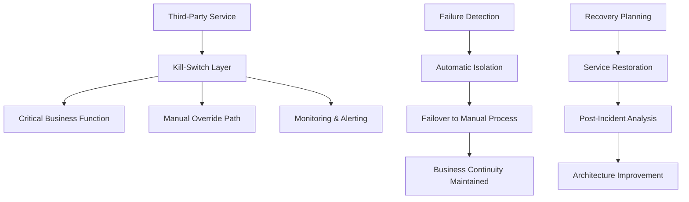

The morning of July 19, 2024, will be etched in cybersecurity history as the day a single defective update brought the world to its knees. As millions of Windows machines worldwide flickered to the dreaded Blue Screen of Death, a harsh reality crystallized: our increasingly interconnected digital infrastructure is only as strong as its weakest dependency.

The CrowdStrike incident wasn't just another technical glitch—it was a $5.4 billion lesson in systemic risk that exposed the fragility lurking beneath our digital economy's veneer of robustness. But within this chaos, a different story emerged. Some organizations didn't just survive; they thrived. They demonstrated what it truly means to be antifragile—systems that don't merely bounce back from disruption but emerge stronger, more resilient, and better prepared for future challenges.

## The Anatomy of a Global Digital Catastrophe

Picture this: It's 6:00 AM EST, and Sarah Martinez, CISO at a Fortune 500 financial services firm, receives the first alert. Within minutes, her phone explodes with calls from operations managers, regulatory bodies, and panicked board members. Across 8.5 million Windows machines globally, CrowdStrike's Falcon sensor had pushed a faulty channel file update that caused immediate system crashes.

The ripple effects were staggering. Delta Air Lines canceled over 4,000 flights, stranding hundreds of thousands of passengers. Emergency services in multiple states lost critical communication capabilities. Major hospitals postponed non-emergency surgeries as their systems failed. The London Stock Exchange experienced significant trading delays, while banking systems across Europe and North America struggled to maintain operations.

What made this incident particularly devastating wasn't just its scale—it was the speed and universality of the failure. Unlike traditional cyberattacks that unfold over hours or days, this was instantaneous global paralysis. One faulty update, deployed simultaneously across millions of endpoints, created a synchronized failure unlike anything the cybersecurity community had previously experienced.

The irony was palpable: an endpoint detection and response (EDR) solution designed to protect organizations from cyber threats had become the very vector that brought them down. This wasn't malicious intent—it was a stark reminder that in our hyperconnected world, the tools meant to secure us can become single points of catastrophic failure.

## The Hidden Cost of Digital Dependency

The immediate financial impact was staggering, but the deeper implications were even more profound. The incident exposed how deeply embedded third-party dependencies had become in critical business operations. Organizations discovered they weren't just buying cybersecurity software—they were essentially outsourcing control over their operational continuity to external vendors.

Consider the cascade effect: when CrowdStrike's update failed, it didn't just impact the organizations directly using their software. It affected their customers, suppliers, and partners. Airlines couldn't check passengers in. Banks couldn't process transactions. Medical devices couldn't communicate with central systems. The interconnected nature of modern business meant that a failure in one node propagated through the entire network.

This phenomenon, known as systemic risk, represents one of the greatest challenges facing modern CISOs. Unlike traditional security threats that can be mitigated through layered defenses, systemic risks arise from the very architecture of our digital ecosystems. They're embedded in the dependencies we choose, the trust relationships we establish, and the design decisions we make about redundancy and resilience.

The most chilling aspect of the CrowdStrike incident was how it revealed the illusion of control. Organizations that had invested millions in cybersecurity infrastructure, employed hundreds of security professionals, and implemented comprehensive risk management frameworks suddenly found themselves powerless against a single line of faulty code in a third-party system.

## The Resilience Paradox: Why Traditional Security Models Failed

In the aftermath of July 19th, a uncomfortable truth emerged: many organizations had optimized for the wrong type of resilience. They had built impressive defenses against external threats—advanced threat detection, zero-trust architectures, comprehensive incident response plans—but had neglected the internal vulnerabilities created by their own technology choices.

This represents what I call the "resilience paradox." In our quest to build more secure, efficient, and capable systems, we've increased our dependence on complex, interconnected technologies that can fail in unexpected ways. We've traded simple, controllable risks for complex, systemic ones.

Traditional risk management frameworks, designed for a world of discrete, independent failures, proved inadequate for addressing cascading system failures. Organizations had business continuity plans for power outages, natural disasters, and cyberattacks, but few had prepared for the scenario where their protective systems themselves became the threat.

The regulatory landscape added another layer of complexity. In the UK, the Financial Conduct Authority's PS21/3 operational resilience rules had already begun requiring firms to identify and map their important business services, establish impact tolerances, and conduct severe-but-plausible scenario testing. Organizations that had treated these requirements as compliance checkbox exercises found themselves woefully unprepared, while those who had embraced the spirit of operational resilience weathered the storm far better.

## The Architecture of Antifragility: Core Principles for Modern CISOs

The organizations that emerged stronger from the CrowdStrike crisis shared common characteristics. They had moved beyond traditional business continuity planning to embrace what Nassim Taleb calls "antifragility"—the property of systems that grow stronger from stressors and volatility rather than merely surviving them.

### 1. Dependency Mapping and Single Point of Failure Analysis

The first principle of antifragile architecture is comprehensive dependency mapping. This goes far beyond typical IT asset inventories to include a deep understanding of how third-party services integrate with critical business functions.

Sarah's organization had implemented what they called "Failure Mode Analysis" six months before the CrowdStrike incident. Every critical business service was mapped not just to its primary technology dependencies, but to the cascading impacts of each dependency's failure. They had identified that their EDR solution sat at a critical junction—if it failed, it could potentially impact endpoint connectivity, system boot sequences, and administrative access across their entire infrastructure.

This analysis led them to implement what they termed "graceful degradation pathways"—predetermined methods for maintaining essential business functions even when primary systems failed. When CrowdStrike's update caused their Windows machines to crash, they activated these pathways, maintaining customer service capabilities and regulatory reporting requirements while technical teams worked on recovery.

### 2. Ring-Fenced Deployment Strategies

The second principle involves implementing strict limitations on simultaneous deployments across infrastructure. The most resilient organizations had already adopted what they called "ring-fenced pilot cohorts"—never allowing any single update to affect more than 5% of their infrastructure simultaneously.

This approach requires sophisticated deployment orchestration and strong change management discipline. Organizations must resist the efficiency gains of mass simultaneous deployments in favor of gradual, controlled rollouts with defined observation windows and rollback triggers.

One multinational corporation had implemented a "72-hour rule"—any significant third-party update must be deployed first to a small pilot group, observed for 72 hours with specific performance and stability metrics, and only then gradually expanded to broader infrastructure. This rule alone prevented them from experiencing the full impact of the CrowdStrike failure.

### 3. Out-of-Band Communication and Control Channels

The third principle recognizes that when primary systems fail, secondary communication and control mechanisms become critical. Organizations need independent pathways for coordination and recovery that don't depend on the same infrastructure or vendors as their primary systems.

This means maintaining separate communication channels (different vendors, different network paths), alternative administrative access methods, and independent monitoring and alerting systems. When CrowdStrike's failure took down primary endpoints, these organizations could still communicate, coordinate response efforts, and execute recovery procedures.

## The Kill-Switch Imperative: Designing for Controllable Failure

Perhaps the most important lesson from the CrowdStrike incident is the need for what I call "kill-switch architecture." This goes beyond traditional rollback capabilities to include the ability to rapidly and completely disconnect from problematic third-party services while maintaining essential business functions.

Kill-switch architecture requires organizations to design their systems with the assumption that any third-party dependency might need to be rapidly disconnected. This means:

1. **Functional Independence**: Critical business processes must be capable of operating, even if in degraded mode, without any single third-party dependency.

2. **Rapid Isolation**: Organizations need technical and procedural mechanisms to quickly isolate problematic services without affecting other systems.

For today's CISOs and security professionals, building antifragile organizations is essential—not merely for compliance but as a strategic advantage in an era where operational resilience can dictate success or failure. Read for more information.
