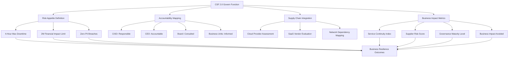

When Sarah Martinez, CISO at a Fortune 500 manufacturing company, presented her quarterly security metrics to the board last year, she watched executive eyes glaze over as she detailed patch compliance percentages and vulnerability counts. Six months later, after implementing NIST CSF 2.0's Govern function as a true business governance framework, she opened her presentation with a different story: "Our cybersecurity investments prevented $3.2 million in potential business disruption this quarter while enabling a 15% increase in digital service availability."

The transformation wasn't just in her presentation—it was in how her entire organization approached cybersecurity risk.

## The Hidden Revolution in NIST CSF 2.0

Most security leaders are making a critical error in their understanding of NIST CSF 2.0. They're treating the new Govern function as another compliance requirement, filing it alongside their existing frameworks without recognizing its revolutionary potential. This checkbox mentality is costing organizations millions in unrealized value and leaving them fundamentally vulnerable to modern threats.

The February 2024 release of NIST CSF 2.0 didn't just add a sixth function to the framework—it fundamentally redefined cybersecurity from a technical discipline into a business governance imperative. While the headlines focused on the expanded scope beyond critical infrastructure, the real transformation lies in how the Govern function bridges the persistent gap between cybersecurity investments and measurable business outcomes.

Consider this: Traditional cybersecurity frameworks have always struggled with the "so what?" question from business leaders. A CISO might report 99.9% uptime on security systems, but what does that mean for revenue protection, customer satisfaction, or competitive advantage? NIST CSF 2.0's Govern function provides the missing link—a structured approach to translating security activities into business language that executives not only understand but actively champion.

## The Architecture of Actionable Governance

The power of the Govern function lies not in its existence, but in its operationalization. Too many organizations approach governance as a documentation exercise—creating policies, procedures, and organizational charts that look impressive in audit presentations but fail to drive real behavioral change or risk reduction.

True governance integration begins with establishing clear cyber risk appetite statements that go far beyond generic "low risk tolerance" declarations. Organizations achieving real resilience define specific, measurable thresholds that become decision-making criteria for every security investment and operational choice.

Take the example of a global financial services firm that recently transformed their risk appetite from a two-page policy document into actionable metrics: maximum acceptable downtime of 4 hours annually across critical services, financial impact limits of $2 million per incident, and zero tolerance for personally identifiable information breaches. These weren't arbitrary numbers—they were carefully calculated based on regulatory requirements, competitive positioning, and actual business impact analysis.

With these thresholds established, every security decision became clear. When evaluating a new email security solution, the question wasn't whether it met industry best practices, but whether it helped maintain their 4-hour annual downtime limit while staying within their $2 million incident impact threshold. Investment priorities became self-evident, and business leaders understood exactly what they were funding.

## Accountability Architecture: Moving Beyond Organizational Charts

One of the most persistent challenges in cybersecurity governance has been the ambiguity of roles and responsibilities. Who owns cybersecurity risk? Who makes decisions about acceptable risk levels? Who is accountable when things go wrong? Traditional approaches often create overlapping responsibilities that result in accountability gaps during critical incidents.

The RASCI (Responsible, Accountable, Consulted, Informed) methodology provides a precise framework for mapping cybersecurity governance roles. In high-performing organizations, these assignments are specific and unambiguous: The CISO is Responsible for conducting risk assessments and implementing controls, but the CEO remains Accountable for risk acceptance decisions that could impact business strategy. The board is Consulted on major strategic cybersecurity decisions, particularly those involving significant investment or risk tolerance changes, while business unit leaders are Informed about their specific security obligations and the potential business impact of security incidents.

This clarity becomes critical during incident response. When a supply chain attack threatens customer data, there's no confusion about who makes the decision to operate in degraded mode versus shutting down services entirely. The accountability framework established through proper governance implementation ensures rapid, appropriate decision-making when every minute counts.

## Supply Chain Risk as Core Business Governance

Perhaps nowhere is the governance evolution more critical than in third-party risk management. Traditional approaches treat supplier risk assessments as separate processes, often managed by procurement teams with limited cybersecurity expertise or by security teams with insufficient business context. NIST CSF 2.0's governance framework demands integration.

Leading organizations are embedding supply chain risk assessment into their core governance committees, applying the same rigor to cloud providers and SaaS vendors that they apply to internal systems. This isn't just about questionnaires and certifications—it's about understanding how third-party failures could cascade through business operations and building governance processes that proactively manage those interdependencies.

Consider the interconnected risk of a modern cloud-first organization. Their customer relationship management system depends on a SaaS provider, which relies on a cloud infrastructure provider, which depends on multiple network providers. A failure at any point in this chain could disrupt customer operations, but traditional risk assessments evaluate each provider in isolation. Governance-integrated supply chain risk management maps these dependencies and ensures that business continuity plans account for cascading failures.

## Business Impact Translation: The Language of Value

The most transformative aspect of operationalizing NIST CSF 2.0's Govern function is the shift from security metrics to business impact metrics. This isn't about dumbing down security reporting—it's about elevating security's strategic importance by demonstrating clear connections between cybersecurity investments and business outcomes.

Instead of reporting "99.9% patch compliance," mature organizations report "reduced business disruption risk by 40% through proactive vulnerability management." Rather than tracking "number of security incidents," they measure "business services maintained during security events" and "revenue protection through incident response."

This translation requires mapping each CSF subcategory to specific business services and quantifying the potential impact of failures. When authentication systems experience problems, organizations need to know the revenue impact per minute of downtime, the customer satisfaction implications, and the regulatory consequences. This business impact data then drives investment priorities and helps justify security spending in terms that finance teams and executives naturally understand.

## Framework Integration: CSF 2.0 and ISO 27001 Synergy

Many organizations struggle with managing multiple frameworks simultaneously, often treating NIST CSF 2.0 and ISO 27001 as competing standards. Sophisticated security leaders recognize these as complementary tools that, when properly integrated, provide comprehensive governance coverage.

A practical mapping exercise reveals the strategic differences between these frameworks and how to leverage both effectively. CSF's Govern category GV.RO (Risk Oversight) emphasizes risk governance and business alignment, while ISO 27001:2022 controls A.5.1 (Information Security Policy) and A.6.1 (Information Security Roles) focus on policy management and organizational structure.

This distinction is powerful: Use ISO 27001 to establish the foundational policies and procedures that ensure consistent security implementation, then use CSF 2.0's governance framework to connect those activities to business outcomes and strategic decision-making. Organizations that master this integration avoid the compliance burden of managing redundant processes while gaining the strategic advantages of both frameworks.

The gap analysis between these frameworks often reveals whether an organization is truly governing cybersecurity risk or merely managing documentation. If your program can demonstrate clear connections between ISO 27001 controls and CSF business outcomes, you're governing risk. If you're primarily focused on policy compliance and audit readiness, you're managing documentation—and missing the strategic opportunity.

## Quarterly KPIs That Matter

Track these four metrics for real governance insight:
- Service Continuity Index: percentage of critical services meeting availability targets
- Supplier Risk Score: weighted average of third-party risk assessments
- Governance Maturity Level: CSF implementation score across all six functions  
- Business Impact Avoided: financial value of prevented incidents

## Board Reporting Template

Structure your quarterly reports around three questions: What changed in our risk landscape? How did our security investments perform against business objectives? What decisions do we need to make this quarter? Lead with business context, support with security data, and always include specific asks or recommendations.

# Conclusion

The organizations that master CSF 2.0's governance integration won't just be more compliant—they'll be genuinely more resilient. The framework finally gives us the tools to prove security's business value in language executives understand.