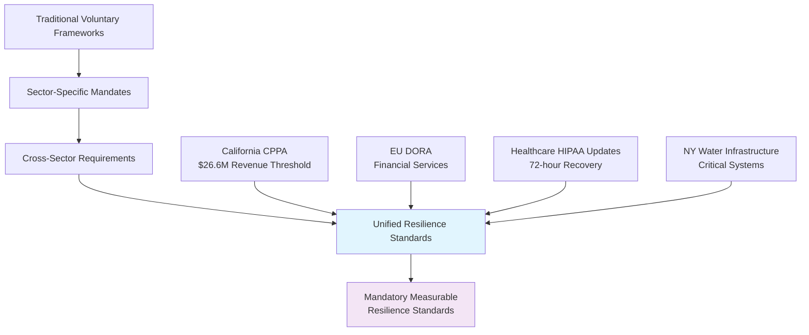

## Introduction

The cybersecurity regulatory landscape has undergone a seismic shift, and the tremors are being felt across every sector. What was once a patchwork of voluntary guidelines and industry-specific recommendations has evolved into a comprehensive framework of mandatory, measurable resilience standards that are reshaping how organizations approach cybersecurity strategy.

The transformation is not subtle—it's dramatic, definitive, and demanding immediate attention from security leaders who have long operated under the assumption that compliance was optional or industry-specific. Today's reality presents a different narrative entirely.

## The Regulatory Convergence: A Perfect Storm of Mandates

Picture this scenario: You're a CISO at a mid-sized technology company with $50 million in annual revenue. Eighteen months ago, your primary regulatory concerns centered around industry-specific frameworks and voluntary compliance standards. Today, you're facing California's Consumer Privacy Protection Act (CPPA) requiring annual cybersecurity audits starting January 2026, the EU's Digital Operational Resilience Act (DORA) establishing unified ICT risk management standards, and potential expansion of similar mandates across multiple jurisdictions.

This isn't coincidence—it's convergence. Regulators worldwide have recognized that cybersecurity can no longer be treated as a voluntary enhancement or competitive differentiator. It's become essential infrastructure, as critical to business operations as financial controls or safety protocols.

The California mandate represents a particularly significant milestone. For the first time in U.S. regulatory history, we're witnessing a sector-agnostic cybersecurity requirement that applies broadly across industries based solely on revenue thresholds. Any business generating over $26.6 million annually will be required to undergo comprehensive cybersecurity audits, establishing precedent that other states are already considering adopting.

Meanwhile, DORA's implementation across EU financial services has created a template for operational resilience that extends far beyond traditional security measures. The regulation demands not just protective controls, but demonstrable recovery capabilities, third-party risk management, and continuous testing of digital operational resilience.

## Beyond Financial Services: The Sector Expansion

Healthcare organizations are experiencing their own regulatory evolution with updated HIPAA proposals requiring 72-hour recovery times for critical systems. This isn't merely an extension of existing privacy protections—it's a fundamental shift toward operational resilience requirements that mirror what we're seeing in financial services and critical infrastructure.

New York's proposed water infrastructure cybersecurity rules represent another frontier in this regulatory expansion. Critical infrastructure sectors that have historically operated under less stringent cybersecurity requirements are now facing mandatory standards that align with the sophistication of threats they encounter.

The pattern emerging across these diverse regulatory initiatives reveals a common thread: the recognition that cybersecurity incidents create systemic risks that extend far beyond individual organizations. When a healthcare system's IT infrastructure fails, patient care suffers. When financial services experience operational disruptions, market stability is threatened. When critical infrastructure faces cyber attacks, essential services that millions depend upon can be compromised.

## The Financial Reality: $43 Billion in Compliance Spending

Organizations are already investing heavily in regulatory compliance, with healthcare entities spending approximately $34 billion annually and California businesses allocating over $9 billion to meet various regulatory requirements. However, the majority of this investment follows a reactive model—spending the minimum necessary to achieve compliance rather than leveraging regulatory requirements as catalysts for comprehensive security improvements.

This reactive approach creates a fundamental misalignment between regulatory intent and organizational execution. Regulations like CPPA and DORA aren't designed to create administrative burdens—they're structured to drive meaningful improvements in organizational resilience and security posture.

Consider the mathematics of this misalignment: Organizations spending billions on compliance while continuing to experience increasing numbers of successful cyber attacks, longer recovery times, and more severe business impacts from security incidents. The current approach clearly isn't delivering proportional security improvements relative to investment levels.

## The Strategic Shift: From Constraint to Catalyst

Progressive organizations are recognizing that regulatory requirements, when approached strategically, can serve as powerful justifications for security investments that have been needed for years but difficult to fund through traditional business cases.

Take continuous monitoring as an example. California's requirement for annual cybersecurity audits creates an obvious business case for implementing continuous monitoring capabilities. Rather than conducting point-in-time assessments that provide limited ongoing value, organizations can establish monitoring systems that deliver real-time security insights while simultaneously addressing regulatory requirements.

The ROI calculation becomes compelling when viewed through this lens. Instead of spending resources on annual compliance exercises that provide minimal operational value, organizations can invest in continuous monitoring platforms that deliver daily security intelligence while exceeding regulatory expectations.

## Enterprise-Wide Resilience Programs: The DORA Model

DORA's approach to enterprise-wide resilience provides a blueprint for transforming regulatory compliance into operational advantage. The regulation requires organizations to develop comprehensive ICT risk management frameworks, but smart organizations are interpreting this requirement broadly to create enterprise resilience programs that extend beyond IT systems.

These programs integrate cybersecurity, business continuity, operational resilience, and third-party risk management into unified frameworks that provide holistic organizational protection. Rather than managing cybersecurity as an isolated function, organizations are creating integrated resilience capabilities that address the full spectrum of operational risks.

The business value of this approach extends far beyond regulatory compliance. Organizations with mature enterprise resilience programs demonstrate measurably better performance during disruptions, faster recovery times, and more predictable operational outcomes—characteristics that create competitive advantages in uncertain business environments.

## Transforming Audit Requirements into Security Intelligence

Annual audit requirements, rather than being viewed as compliance burdens, can be transformed into structured security intelligence programs. Organizations that approach audits strategically use them as opportunities to:

**Establish Baseline Security Metrics:** Comprehensive audits provide detailed snapshots of security posture that can serve as baselines for measuring improvement over time.

**Identify Investment Priorities:** Professional security assessments reveal gaps and vulnerabilities that help prioritize security investments and resource allocation.

**Demonstrate Progress to Stakeholders:** Regular audit results provide concrete evidence of security improvements that can be presented to boards, investors, and customers.

**Benchmark Against Industry Peers:** Audit findings can be compared against industry benchmarks to understand relative security maturity and competitive positioning.

## The Competitive Advantage Framework

Organizations that successfully transform regulatory compliance into competitive advantage typically follow a consistent framework:

**Risk-Based Prioritization:** Rather than attempting to achieve perfect compliance across all requirements simultaneously, they prioritize based on risk levels and business impact potential.

**Integration Over Isolation:** They integrate compliance activities with existing security operations rather than treating them as separate initiatives.

**Continuous Improvement:** They establish processes for continuous improvement rather than pursuing point-in-time compliance achievements.

**Stakeholder Communication:** They develop clear communication strategies that help stakeholders understand the business value of compliance investments.

**Measurement and Metrics:** They establish quantitative measures that demonstrate the business impact of compliance-driven security improvements.

## Third-Party Risk Management: The Extended Enterprise Challenge

Modern regulatory frameworks recognize that organizational security extends far beyond internal systems and controls. DORA's third-party risk management requirements exemplify this trend, requiring organizations to maintain oversight of critical service providers and establish resilience requirements for key vendors.

This regulatory focus on extended enterprise security creates opportunities for organizations to strengthen their entire ecosystem rather than simply protecting internal assets. Companies that approach third-party risk management strategically often discover that their vendor security requirements drive improvements throughout their supply chains, creating industry-wide resilience improvements that benefit all participants.

## Recovery Time Objectives: From Aspiration to Requirement

Healthcare's proposed 72-hour recovery requirements represent a shift from aspirational recovery objectives to mandatory performance standards. This transformation forces organizations to move beyond theoretical business continuity plans to proven recovery capabilities.

Organizations that embrace this shift often discover that mandatory recovery requirements drive innovations in system architecture, data management, and operational processes that deliver benefits far beyond compliance. Designing systems for rapid recovery creates inherently more resilient architectures that perform better under normal operating conditions.

## The Technology Investment Justification

Regulatory requirements provide powerful justifications for technology investments that improve both compliance posture and operational capabilities. Security orchestration platforms, automated monitoring systems, and integrated risk management tools deliver compliance benefits while enhancing day-to-day security operations.

The key insight is recognizing that regulatory requirements often align closely with security best practices that organizations should be implementing regardless of compliance obligations. Smart organizations use regulatory mandates as catalysts for adopting technologies and processes that deliver lasting operational improvements.

## Board-Level Engagement and Executive Support

Regulatory requirements create natural opportunities for security leaders to engage