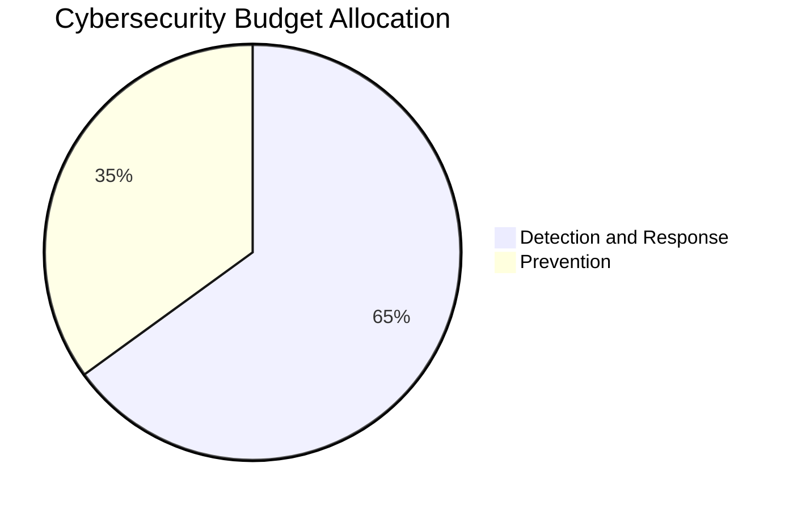

# Building Cyber Resilience: The New Age Fortress

In today's digital epoch, where cyber threats loom large and breaches are not just a possibility but an inevitability, it's crucial for Chief Information Security Officers (CISOs) and Information Security Executives to rethink their approach to cybersecurity. The adage that the likelihood of experiencing a cybersecurity event is 100% serves not as a harbinger of doom but as a clarion call for preparedness and resilience. This blog will explore the evolving landscape of cybersecurity, focusing on building resilience and implementing effective strategies during inevitable breaches.

## The Shifting Paradigm: From Prevention to Resilience

Historically, organizations have poured significant resources into preventive measures aimed at thwarting cyber threats before they manifest. Firewalls, antivirus software, and intrusion detection systems are all critical components of this preventive approach. However, with the sophistication of cybercriminals and the emergence of increasingly complex threats, this model is no longer sufficient on its own.

### Why Resilience Matters

Resilience in cybersecurity means more than just avoiding breaches; it’s about preparing for them and minimizing their impact. As breaches become almost a certainty, organizations must pivot towards a mindset that emphasizes readiness and response. Gartner’s study points out that organizations should allocate 60-70% of their cybersecurity budgets to detection and response capabilities. This marks a fundamental shift in strategy; it's not merely about how to prevent an attack, but rather how to respond effectively when an attack occurs.

### Strengthening the Fortress: Key Strategies

1. **Adopting Proactive Preparedness:**
   - **Simulation Training:** Just as a fortress prepares its defenses, organizations need to engage in regular simulation exercises. These drills enable teams to practice their response protocols in real-world scenarios, which can significantly enhance their readiness. Training staff to recognize phishing attempts and suspicious activities can help create an agile and informed workforce.

2. **Leveraging Real-Time Monitoring:**
   - Implementing advanced monitoring tools that provide real-time insights into system activity is essential. These tools can detect anomalies that might indicate a breach in progress, allowing teams to act swiftly. The importance of having a Security Operations Center (SOC) stands out here—it is the command center that enables organizations to oversee security events, assess threats, and respond accordingly.

3. **Building Rapid Response Strategies:**
   - A well-defined incident response plan is the cornerstone of resilience. Organizations must ensure that their incident response teams are equipped with the necessary skills and authority to act without delay when a breach is detected. Rapid response mechanisms can effectively contain breaches, preventing further damage and loss of sensitive information.

4. **Implementing Robust Communication Channels:**
   - In the event of a cyber incident, timely communication with stakeholders, customers, and the media is crucial. Transparency builds trust, and organizations that can communicate effectively during a breach often fare better in maintaining customer loyalty.

5. **Investing in Threat Intelligence:**
   - A fortress is as strong as its knowledge of potential threats. Regularly updating threat intelligence can help organizations stay ahead of emerging attack vectors. By understanding the tactics used by attackers, organizations can tailor their defenses to mitigate these risks.

6. **Fostering a Culture of Security:**
   - Establishing a security-first culture within an organization encourages all employees to take an active role in cybersecurity. This can involve employee education about potential threats, ensuring everyone understands how their actions can impact overall security.

### Visualization: The Cyber Fortress

To truly understand the principles of cyber resilience, imagine a fortress standing with digital locks, shields, and enhanced physical defenses against inevitable breaches. On the rocky ledge—symbolizing strength—this fortress is equipped for readiness and action. The infographic elements should convey critical aspects: a pie chart illustrating budget allocation ranging from 60-70% for detection and response, underscoring an evolved strategy aligned with today’s threat landscape.

## Case Studies: Learning From the Leaders

To further contextualize these strategies, let’s look at a couple of leading organizations that have successfully implemented resilience-focused cybersecurity protocols.

### Case Study 1: Medium Enterprise in the Retail Sector

A medium-sized retail enterprise faced a ransomware attack that halted its operations overnight. However, thanks to a robust incident response plan and continuous employee training, the company was able to restore its systems within 48 hours. They had allocated 70% of their cybersecurity budget towards detection and response, which included regular simulations and monitoring. The rapidity of their response not only limited their losses but also reinforced customer trust.

### Case Study 2: Financial Institution

A prominent financial institution experienced a data breach compromising sensitive customer information. Fortunately, their proactive investment in cybersecurity—allocating 65% of their budget to threat detection and real-time monitoring—allowed them to identify the attack early. Although the breach was unfortunate, their swift action ensured that customer data was secured and clients were informed, ultimately protecting the institution’s reputation.

## Designing a Cyber Resilient Future

The implications of shifting from a preventive mindset to one centered on resilience are profound. Organizations that adopt this new paradigm will not only be more adept at managing breaches but will also be better positioned to cultivate customer trust and loyalty. In a world where cyber threats are increasingly sophisticated, resilience is no longer optional but rather essential.

### The Road Ahead for CISOs

As CISOs and Information Security Executives, the transition to a resilient cybersecurity framework requires a committed strategy, adequate resource allocation, and a culture of vigilance.

- **Adaptation:** Consider how your organization is adapting to this mindset shift. Are your detection and response protocols robust enough?
- **Readiness:** Are your teams prepared for when—not if—a cybersecurity event occurs?
- **Innovation:** Identify ways to innovate your defense strategies. Could new technologies or methodologies enhance your readiness?

## Conclusion: Engaging in Discussion

The quest for cybersecurity resilience is ongoing and evolving. As an industry, we must engage in open discussions to learn from both successes and failures.

Now, I invite you to share your thoughts:
- How has your organization adapted to the increasing inevitability of cyber breaches?
- What strategies have you implemented that could serve as a model for others seeking to enhance resilience?

Let’s discuss, innovate, and together fortify our defenses against the inevitable cyber threats we face.