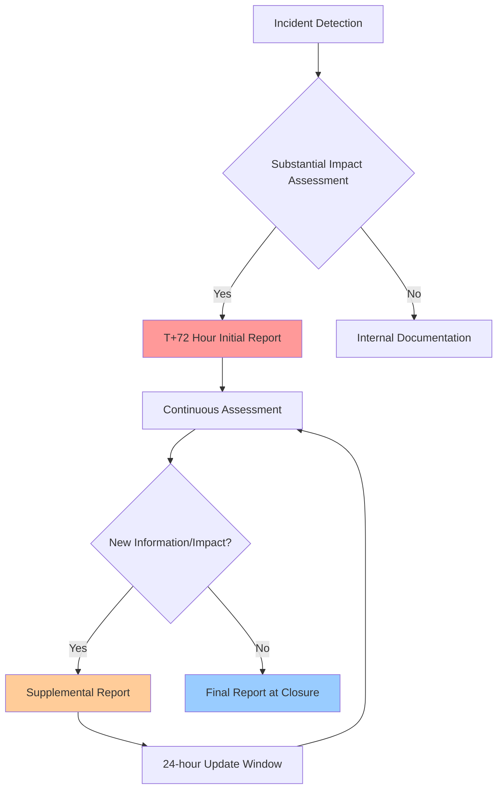

The cybersecurity landscape just shifted in your favor. When CISA announced the delay of the CIRCIA Final Rule implementation to May 2026, it wasn't just bureaucratic red tape—it was a strategic opportunity disguised as regulatory breathing room. For CISOs and security executives who've been juggling multiple compliance frameworks while fighting daily security battles, this eight-month extension represents something invaluable: time to build the reporting infrastructure that will define your organization's resilience for years to come.

But here's the reality check: this isn't a hall pass to procrastinate. The organizations that treat this delay as a chance to perfect their incident response and reporting capabilities will emerge as leaders, while those who coast will find themselves scrambling when May 2026 arrives with the same unforgiving deadlines and potentially more complex threat landscape.

## The Hidden Cost of Reporting Chaos

Picture this: It's 2:47 AM on a Tuesday, and your SOC just detected lateral movement across critical infrastructure. Your incident response team is in full swing, but then comes the dreaded question: "Who needs to be notified, and when?"

What follows is a familiar nightmare. Someone frantically searches through different compliance matrices—SEC requirements demand disclosure within four business days if material, your state attorney general wants notification within 72 hours, sector-specific regulations have their own timelines, and now CIRCIA will require substantial incidents to be reported within 72 hours and ransomware payments within 24 hours.

Your IR team, already stretched thin managing the actual incident, suddenly becomes a compliance coordination center. Critical decisions get delayed while analysts try to determine which regulatory framework takes precedence. Meanwhile, the threat actor isn't waiting for your team to figure out paperwork.

This scenario plays out in organizations across every sector, creating what I call "compliance paralysis"—the moment when regulatory overhead begins to actively impede effective incident response. The CIRCIA delay gives us the runway to solve this problem systematically.

## Building the Unified Reporting Engine

The smartest security leaders are using this extension to construct what should have existed all along: a unified incident intake and reporting system that treats regulatory compliance as an output, not a parallel process.

Think of it as building a sophisticated routing system. When an incident is declared, your unified engine immediately begins collecting the standardized data elements required across all applicable frameworks. Instead of maintaining separate workflows for SEC, state AG, sectoral, and CIRCIA reporting, you're feeding one comprehensive system that generates appropriate outputs for each regulator based on pre-configured logic trees.

The technical architecture matters less than the operational philosophy. Whether you're building this capability in-house, leveraging a GRC platform, or working with specialized incident response vendors, the key is designing for regulatory agnostic data collection from day one.

Consider establishing these core data categories in your unified system:

**Timeline Elements**: Precise timestamps for detection, containment, eradication, and recovery phases, automatically formatted for each regulatory requirement's specific deadline calculations.

**Impact Quantification**: Structured fields that capture both technical impact (systems affected, data involved, operational disruption) and business impact (financial loss estimates, customer effects, regulatory exposure) in ways that support multiple reporting thresholds.

**Threat Intelligence Integration**: Automated enrichment of incident data with threat actor attribution, TTPs, and IOCs that support both internal analysis and external reporting requirements.

**Decision Points and Authority**: Built-in workflows that document key decisions, decision-makers, and rationales—critical for demonstrating governance maturity to regulators and boards.

## The Art of T+72 Hour Reporting

The 72-hour substantial incident reporting requirement under CIRCIA presents a unique challenge that goes beyond technical implementation: how do you provide meaningful, accurate information about an incident that you're still investigating?

This is where many organizations will stumble. The natural tendency is to either over-report (flooding regulators with preliminary speculation) or under-report (waiting for complete analysis before disclosure). Both approaches create regulatory risk.

The solution lies in mastering what I call "progressive disclosure"—a structured approach to communicating what you know, what you don't know, and what you're doing about the knowledge gaps at each reporting milestone.

Your T+72 reporting template should be structured around three critical pillars:

**Confirmed Facts**: What your investigation has definitively established, including specific systems affected, attack vectors confirmed, and containment measures implemented. This section should read like incident response findings, not speculation.

**Active Unknowns**: Explicit acknowledgment of what remains under investigation, with clear timelines for when additional information will be available. Regulators appreciate honest uncertainty over confident guesses that later prove wrong.

**Operational Impact Metrics**: Quantified disruption measurements using consistent methodologies across incidents. This might include system availability percentages, affected user counts, or financial impact estimates with clearly stated confidence intervals.

The goal isn't to impress regulators with the depth of your initial analysis—it's to demonstrate that you have a systematic approach to understanding and communicating incident scope even under pressure.

## Navigating Third-Party Incident Complexity

One of the most challenging aspects of CIRCIA compliance will be determining when supplier or vendor incidents trigger your own reporting obligations. The "substantial impact" threshold isn't just about direct technical effects—it encompasses operational disruption, data exposure, and cascading risks that may not be immediately apparent.

Smart CISOs are building decision trees that help their teams make consistent determinations about third-party incident reporting requirements. This isn't just about legal compliance; it's about demonstrating mature risk management practices to regulators and stakeholders.

Your decision framework should evaluate multiple impact vectors:

**Direct Operational Impact**: Can your organization continue critical business functions without the affected vendor service? How long can you operate using backup systems or manual processes?

**Data Exposure Risk**: Does the vendor incident potentially expose your organization's sensitive data, customer information, or intellectual property? Consider both confirmed exposures and reasonable worst-case scenarios.

**Cascade Potential**: Could the vendor incident enable attackers to pivot into your environment, or does it reveal vulnerabilities in shared infrastructure that could be exploited against your organization?

**Regulatory Overlap**: Is the same incident subject to other reporting requirements (SEC, state laws, sectoral regulations) that might influence the substantial impact determination?

The key is establishing clear thresholds and making these determinations proactively, not reactively during high-stress incident response situations. Your legal and compliance teams should be involved in developing these criteria, ensuring they align with your organization's risk tolerance and regulatory obligations.

## Pre-Positioning Your Response Infrastructure

The best incident response plans are those that can be executed under the worst possible circumstances—when your primary systems are compromised, key personnel are unavailable, and normal communication channels are disrupted. CIRCIA compliance adds another layer of complexity to this challenge by introducing strict notification deadlines that don't pause for technical difficulties.

Building your external response team now means more than just having contact information for outside counsel and forensic investigators. It means establishing relationships with specialists who understand the intersection of incident response and regulatory reporting—a surprisingly niche skill set.

Your external team roster should include:

**Incident Response Counsel**: Attorneys who specialize in breach notification and regulatory compliance, with specific experience in your sector's requirements. These aren't general corporate lawyers; they're specialists who can provide real-time guidance on disclosure obligations while your incident unfolds.

**Technical Forensic Partners**: Investigation firms with the capacity to support regulatory reporting timelines, not just technical analysis. Look for partners who can provide preliminary findings within regulation deadlines and understand how to structure their analysis for regulatory consumption.

**Communication Specialists**: Crisis communication professionals who can help craft external notifications that satisfy regulatory requirements while protecting your organization's reputation and legal position.

**Sector-Specific Experts**: Depending on your industry, you may need specialists familiar with unique sectoral requirements (financial services, healthcare, critical infrastructure) that overlay CIRCIA obligations.

The relationship-building aspect is crucial. These aren't vendors you want to be interviewing for the first time during an active incident. Establish retainer agreements, conduct regular touch-bases, and include them in tabletop exercises so they understand your organization's environment and priorities.

## The Ransom Payment Governance Challenge

Perhaps the most sensitive aspect of CIRCIA compliance is the 24-hour ransom payment reporting requirement. This creates a governance challenge that goes far beyond compliance: how do you establish decision-making protocols for ransom scenarios without creating corporate policies that could be interpreted as normalizing payment?

This is where many organizations will struggle with both legal exposure and practical implementation. 
