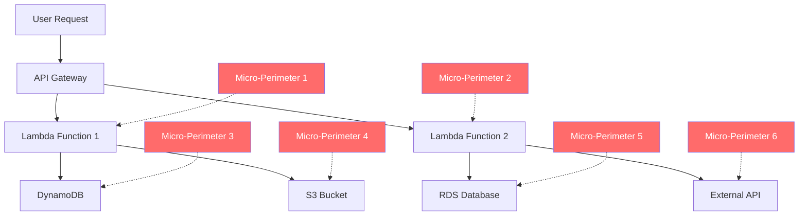

## Introduction

In the gleaming headquarters of a Fortune 500 financial services company, their CISO stared at a dashboard that painted an alarming picture. Despite investing millions in cutting-edge security tools, their cloud environment housed over 15,000 non-human identities—service accounts, API keys, and machine credentials—each one a potential gateway for sophisticated attackers. This scenario isn't unique; it's the new reality facing security leaders worldwide as cloud infrastructure evolves faster than our ability to secure it.

The statistics are sobering. Recent analysis across hundreds of cloud deployments reveals that 72% of cloud environments have publicly exposed databases, while 79% of cloud detections involve malware-free attacks using legitimate tools. These numbers aren't just data points—they represent a fundamental shift in how we must approach cloud security in an era where the traditional perimeter has not just weakened, but completely dissolved.

## The Dissolution of the Security Perimeter

Remember when security was simple? When we could draw clear lines between "inside" and "outside," between trusted and untrusted networks? Those days are ancient history. The cloud has fundamentally altered the threat landscape, creating what security experts now call the "perimeter-less enterprise."

In traditional data centers, security teams could rely on network segmentation and perimeter defenses. Firewalls, intrusion detection systems, and access controls created layers of protection around a relatively static infrastructure. But cloud environments operate on entirely different principles. Infrastructure spins up and down in milliseconds, applications scale automatically based on demand, and workloads can migrate across regions without human intervention.

Consider the complexity of a modern serverless architecture. A single user interaction might trigger dozens of Lambda functions, each communicating with different microservices, databases, and third-party APIs. Each component represents a micro-perimeter that exists for mere moments before disappearing. Traditional security models, built for static environments, struggle to keep pace with this ephemeral infrastructure.

This diagram illustrates how a single user request creates multiple micro-perimeters, each requiring individual security considerations. Unlike traditional monolithic applications with clear boundaries, serverless architectures create hundreds or thousands of these dynamic security zones that change constantly.

## The Rise of Malware-Free Attacks

The 79% statistic about malware-free attacks represents perhaps the most significant shift in the threat landscape. Attackers have evolved beyond crude malware injection to sophisticated techniques that leverage legitimate cloud services and tools. These "living off the land" attacks are particularly insidious because they use the very tools that organizations rely on for legitimate operations.

A real-world example demonstrates this evolution. In 2023, security researchers discovered attackers using AWS Lambda functions to cryptocurrency mine, not by installing malicious software, but by exploiting misconfigured IAM roles. The attackers gained access through exposed API keys, then used legitimate AWS services to spin up compute resources. Traditional antivirus solutions were useless because no malware was involved—just the abuse of legitimate cloud services.

These attacks often follow a predictable pattern:

1. **Initial Access**: Exploitation of misconfigured cloud resources or stolen credentials
2. **Privilege Escalation**: Using legitimate IAM services to gain broader access
3. **Lateral Movement**: Leveraging service-to-service communications and shared resources
4. **Data Exfiltration**: Using standard cloud APIs and services to extract data

The sophistication of these attacks has grown exponentially. Threat actors now understand cloud architectures better than many of the organizations they're targeting. They know that a misconfigured S3 bucket can provide access to sensitive data, that overprivileged Lambda functions can be exploited for privilege escalation, and that cloud logging often has blind spots they can exploit.

## The Non-Human Identity Crisis

If there's one area where the cloud security challenge becomes most apparent, it's in identity management. Traditional identity and access management (IAM) systems were designed for human users—employees who log in during business hours, use familiar applications, and follow predictable patterns. But modern cloud environments are populated primarily by non-human identities.

In a typical enterprise cloud environment, non-human identities outnumber human users by factors of 10 to 1 or even 100 to 1. These include:

- **Service Accounts**: Used by applications to authenticate with cloud services
- **API Keys**: Enable programmatic access to cloud resources
- **Machine Credentials**: Allow automated systems to communicate
- **Container Identities**: Temporary credentials for containerized workloads
- **Serverless Function Roles**: Permissions for individual Lambda functions

Each of these represents a potential attack vector, yet most organizations have limited visibility into these identities, let alone comprehensive management and monitoring capabilities.

The challenge is compounded by the ephemeral nature of cloud workloads. A Lambda function might exist for seconds, receive temporary credentials, perform its task, and disappear—all without human oversight. Traditional identity lifecycle management, with its emphasis on provisioning, regular reviews, and formal deprovisioning, simply doesn't apply to identities that exist for milliseconds.

Consider the story of a technology startup that discovered they had accidentally exposed an API key in a public GitHub repository. Within hours, attackers had used that key to spin up dozens of GPU instances for cryptocurrency mining, racking up thousands of dollars in charges. The breach wasn't detected by traditional security monitoring because the activities appeared legitimate—authorized API calls from valid credentials to create properly configured resources.

## The Skills Gap Amplification Effect

Perhaps the most challenging aspect of cloud security is how cloud complexity amplifies existing skills gaps. Security professionals who spent decades mastering network security, endpoint protection, and perimeter defense suddenly find themselves grappling with IAM policies that span multiple cloud providers, each with different security models and potential attack vectors.

The learning curve is steep. Understanding cloud security requires knowledge of:

- **Multiple Cloud Platforms**: AWS, Azure, and Google Cloud each have different security models
- **Infrastructure as Code**: Security policies must be embedded in Terraform, CloudFormation, and similar tools
- **Container Security**: Docker, Kubernetes, and container registries introduce new attack surfaces
- **Serverless Security**: Function-level security in Lambda, Azure Functions, and Google Cloud Functions
- **DevOps Practices**: Security must integrate with CI/CD pipelines and automated deployments

This complexity challenge is exacerbated by the rapid pace of cloud evolution. Major cloud providers release new services and features weekly. Each new service potentially introduces new security considerations, new configuration options, and new ways for things to go wrong.

A senior security architect at a major retailer shared their experience: "We finally got comfortable securing our EC2 instances, then the development teams moved to containers. Just as we figured out container security, they adopted serverless. Now they're talking about adopting AI services, and I'm not even sure where to start with securing those."

## Understanding Cloud-Native Attack Vectors

To build effective defenses, security leaders must understand how attackers exploit cloud environments. Modern cloud attacks often leverage the very features that make cloud computing attractive: scalability, automation, and service integration.

### Storage Misconfigurations

Public cloud storage represents one of the most common attack vectors. Misconfigured S3 buckets, Azure Blob Storage containers, and Google Cloud Storage buckets have exposed billions of records. The problem isn't just technical misconfiguration—it's often a misunderstanding of cloud shared responsibility models.

Organizations frequently assume that their cloud provider handles all security configurations. In reality, cloud providers secure the infrastructure, while customers are responsible for securing their data and configurations. This fundamental misunderstanding has led to countless data breaches.

### Privilege Escalation Through Cloud Services

Cloud environments offer numerous paths for privilege escalation. An attacker who gains access to a low-privilege service account might exploit cloud-specific features to gain broader access. For example, in AWS, an attacker with the ability to create and attach IAM policies could effectively grant themselves administrative access to the entire environment.

These privilege escalation attacks are particularly dangerous because they often leave