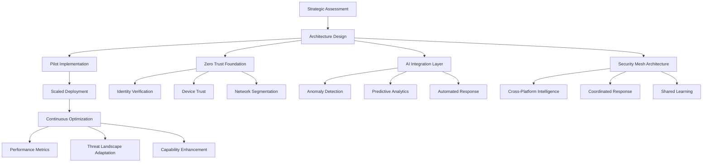

## Introduction

Three months ago, Sarah Chen, CISO at a Fortune 500 manufacturing company, received an alert that would fundamentally change how she thinks about cybersecurity. Her AI-powered security system had identified and contained a sophisticated supply chain attack—not after it happened, but before it could cause damage. The attack vector was novel, the payload unprecedented, yet her adaptive security architecture responded with precision that would have taken her incident response team days to achieve.

This wasn't luck. This was the convergence of Zero Trust architecture and artificial intelligence creating something entirely new: truly autonomous cyber resilience.

## The Paradigm Shift That CISOs Can't Ignore

The cybersecurity landscape has fundamentally shifted, yet most organizations are still operating with yesterday's playbook. While we've been debating the merits of traditional perimeter security versus Zero Trust, artificial intelligence has quietly revolutionized what's possible in cyber defense.

Consider this reality: Google's Big Sleep AI agent recently made international headlines by autonomously discovering CVE-2025-6965, a critical SQLite vulnerability, before any human researcher—or more importantly, any attacker—found it. This milestone represents more than just another AI success story; it's proof that we've entered the era of proactive, autonomous vulnerability discovery.

The implications for security leadership are profound. We're no longer just defending against human attackers who work during business hours and follow predictable patterns. Today's threat landscape includes AI-powered attacks that operate continuously, adapt in real-time, and explore attack vectors faster than any human team can anticipate.

## The Leadership Challenge: Scale vs. Sophistication

When I began my cybersecurity career fifteen years ago, our primary challenge was straightforward: stay one step ahead of human attackers. We hired skilled analysts, invested in better detection tools, and built robust incident response procedures. This approach worked because human threats, while sophisticated, operated within human limitations.

Today, security leaders face an entirely different equation. The (ISC)² Cybersecurity Workforce Study reveals a global shortage of 4 million cybersecurity professionals—a gap that continues widening despite increased investment in training and recruitment. Simultaneously, attackers now leverage AI to automate reconnaissance, customize phishing campaigns, and accelerate exploit development.

The traditional response—hire more analysts, buy more tools—simply doesn't scale against AI-enhanced threats. Organizations that continue down this path find themselves in an unsustainable arms race where costs rise exponentially while effectiveness plateaus.

This is where visionary CISOs are taking a different approach entirely.

## The Convergence Solution: Zero Trust Meets AI

The most successful security transformations I'm witnessing today don't treat Zero Trust and AI as separate initiatives. Instead, they're architecting adaptive security ecosystems where these technologies amplify each other's strengths.

Zero Trust provides the foundational architecture—explicit verification, least privilege access, and assumed breach principles. AI provides the intelligence layer—continuous learning, pattern recognition, and autonomous response capabilities. Together, they create something neither could achieve alone: a security system that adapts, learns, and responds faster than any human attacker or AI threat.

According to NIST SP 1800-35, security organizations now have access to 19 proven Zero Trust implementation blueprints using commercial technologies. These aren't theoretical frameworks—they're battle-tested architectures that organizations are successfully deploying at enterprise scale. When combined with AI-powered security operations, these implementations are delivering results that seemed impossible just two years ago.

## The 40-55% Investigation Time Reduction: What It Really Means

The statistic that's capturing boardroom attention—AI-powered SOCs reducing investigation times by 40-55%—represents far more than operational efficiency. It's evidence of a fundamental shift from reactive to proactive security posture.

In traditional SOCs, skilled analysts spend 60-70% of their time on repetitive tasks: collecting logs, correlating events, validating alerts, and documenting findings. This leaves limited bandwidth for the strategic thinking that actually prevents breaches. AI-powered security operations flip this equation.

Sarah's experience illustrates this transformation perfectly. Her AI security mesh processes over 2 million security events daily, automatically triaging 94% without human intervention. Her analysts now focus exclusively on high-confidence threats and strategic architecture decisions. The result? Her organization detects advanced threats 23 times faster than industry benchmarks while reducing false positives by 87%.

This isn't about replacing security professionals—it's about unleashing their full potential.

## Building Adaptive Security Architectures: The Four Pillars

Organizations that successfully converge Zero Trust and AI focus on four critical architectural pillars:

### 1. Autonomous Vulnerability Discovery

Modern AI agents don't wait for threat intelligence feeds or vulnerability databases. They proactively hunt for weaknesses across the entire attack surface, analyzing code patterns, configuration drift, and behavioral anomalies that indicate potential exploitation vectors.

These systems continuously map your organization's digital assets, identifying not just known vulnerabilities but potential future attack paths. When Google's Big Sleep discovered that SQLite vulnerability, it wasn't following a predefined checklist—it was applying pattern recognition across millions of code samples to identify anomalous structures that could indicate exploitability.

### 2. Dynamic Zero Trust Policy Evolution

Traditional Zero Trust implementations rely on static policies that require manual updates as the environment changes. AI-enhanced Zero Trust architectures continuously evolve these policies based on real-time risk assessment.

Consider user behavior analytics: instead of flagging unusual activity after it happens, AI-driven Zero Trust systems adjust access permissions proactively. If an employee's role changes, travels to a new location, or begins accessing different systems, the architecture automatically calibrates trust levels without requiring help desk intervention or creating security gaps.

### 3. Autonomous Incident Response

The most sophisticated attacks unfold in minutes, not hours. Human response teams, regardless of skill level, cannot match the speed required for effective containment. Autonomous incident response changes this dynamic entirely.

AI-driven response systems can isolate compromised systems, revoke access credentials, and deploy countermeasures faster than any human team while simultaneously gathering forensic evidence and notifying stakeholders. The key is ensuring these systems operate within carefully defined parameters that prevent overreaction while enabling decisive action.

### 4. Interconnected Security Mesh

Rather than deploying AI as isolated point solutions, leading organizations are building security mesh architectures where AI agents communicate, share intelligence, and coordinate responses across the entire enterprise.

This approach creates network effects: each AI agent becomes more effective as it learns from the experiences of others. A threat detected in one environment immediately strengthens defenses across all connected systems, creating organization-wide immunity that evolves in real-time.

## The Strategic Implementation Framework

Successfully implementing this convergence requires more than technology deployment—it demands a fundamental rethinking of security operations and organizational structure.

### Phase 1: Strategic Assessment and Foundation

Begin with comprehensive evaluation of existing security architecture, identifying gaps where AI can provide immediate value while establishing Zero Trust principles. This isn't about replacing functioning systems—it's about identifying integration points where AI can enhance existing capabilities.

The most successful implementations start with high-value use cases: automated threat hunting, intelligent alert prioritization, or dynamic access control. Choose pilots that demonstrate clear ROI while building organizational confidence in AI-driven security operations.

### Phase 2: Intelligent Architecture Design

Design your security mesh architecture with AI integration as a core principle, not an afterthought. This requires careful consideration of data flows, decision points, and human oversight mechanisms.

The architecture must balance automation with control, ensuring AI systems operate within defined parameters while maintaining the flexibility to adapt to novel threats. Establish clear escalation protocols that bring human experts into the loop when situations exceed AI confidence thresholds.

### Phase 3: Scaled Deployment and Optimization

Deploy AI-enhanced Zero Trust capabilities incrementally, measuring performance and refining algorithms based on real-world results. This phase focuses on achieving the 40-55% investigation time reduction while maintaining or improving detection accuracy.

Monitor key metrics: false positive rates, threat detection speed, incident containment time, and analyst productivity. Use these insights to continuously optimize AI models and refine Zero Trust policies.

## The New Role of Security Leadership

This convergence fundamentally reshapes what it means to be a security leader. 