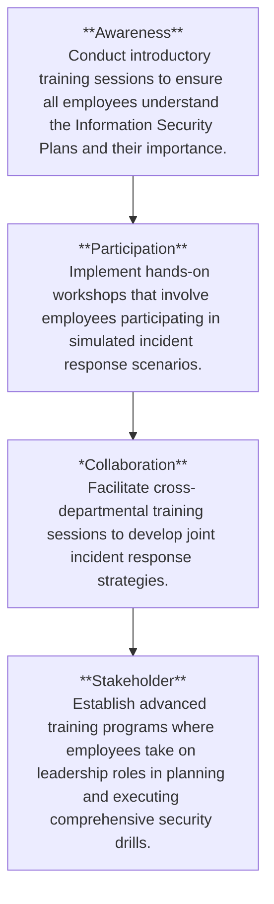

## Welcome to our site

```mermaid
flowchart TD
    A[**Awareness**
    Conduct introductory training sessions to ensure all employees understand the Information Security Plans and their importance.
] --> 
    B[**Participation**
    Implement hands-on workshops that involve employees participating in simulated incident response scenarios.
] -->
    C[*Collaboration**
    Facilitate cross-departmental training sessions to develop joint incident response strategies.
] -->
    D[**Stakeholder**
    Establish advanced training programs where employees take on leadership roles in planning and executing comprehensive security drills.
]
```
